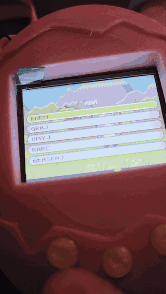

  

  
   
  <a href=".github/adagotchi.mp4">Obejrzyj całe nagranie z dźwiękiem</a>

### Co to jest

Adagotchi to elektroniczna zabawka w stylu tamagotchi, zbudowana od zera: układ na ESP32-S3,
obudowa wydrukowana na drukarce 3D i własna gra. Opiekujesz się stworkiem, który rośnie, je,
bawi się, choruje, śpi w nocy i w końcu się starzeje. Steruje się trzema przyciskami i pokrętłem.

### Co potrafi

* Pięć etapów życia, pogoda, pory roku brane z prawdziwego kalendarza, pięć minigier i osiągnięcia.
* Cała grafika i muzyka powstają w kodzie, bez ani jednego pliku graficznego i dźwiękowego.
* Zabawka łączy się z Wi-Fi i raz na dobę sprawdza, czy pojawiła się nowa wersja gry.
* Na jednym ładowaniu działa około tygodnia, gdy leży odłożona na bok.
* Gra działa też w przeglądarce, a testy pilnują, żeby obie wersje wyglądały tak samo.

### Co leży w tym repozytorium

To nie jest repozytorium ze źródłami, tylko kanał aktualizacji dla urządzenia:

* `firmware/adagotchi.enc`: zaszyfrowany obraz firmware,
* `firmware/version.txt`: numer najnowszej wersji.

Zabawka sama tu zagląda, pobiera nowszą wersję, sprawdza jej podpis i instaluje ją u siebie.
Obraz jest zaszyfrowany, a podpisu nie da się podrobić, więc urządzenie przyjmie wyłącznie
aktualizację wydaną przeze mnie. Kod źródłowy gry i firmware nie jest publiczny.
